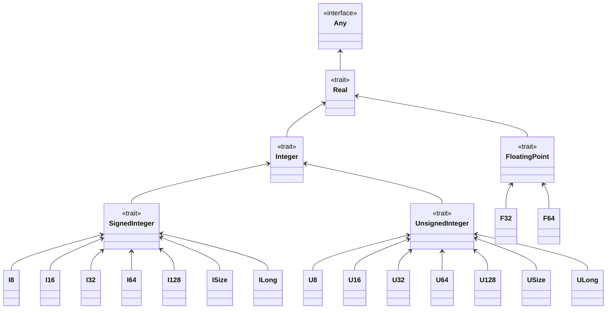
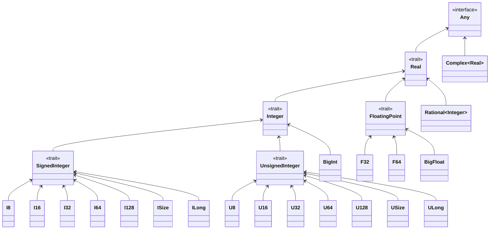

- Feature Name: Introduce new numerics -- `Rational`, `BigInt`, `BigFloat`, `Complex`
- Start Date: 2022-02-28
- RFC PR:
- Pony Issue:

# Summary

This RFC proposes the introduction of new numeric types; in particular the addition of a type representing a fractional number (`Rational`), arbitrary precision integer (`BigInt`), arbitrary precision float (`BigFloat`), and complex number (`Complex`).

# Motivation

The primary motivation for adding these types to the stdlib is to have a single canonical implementation of them which allow interoperability of numeric types across the Pony ecosystem.

# Detailed design

I propose we add the aforementioned numeric types into `builtin` so they exist alongside the other standard numeric types. These introduced numeric types **must** existing within the current numeric type hierarchy by being compliant with existing numeric traits.

## Numeric Hierarchy

Current the Pony numeric type hierarchy is as follows:



This RFC introduces four more numeric types: `Rational`, `BigInt`, `BigFloat`, and `Complex`. These fit into the numeric type hierarchy in the following manner:



## Methods of Concern

```pony
trait val Real[A: Real[A] val] is
  (Stringable & _ArithmeticConvertible & Comparable[A])
  ...
  new val min_value()
  new val max_value()
  ...
```

`Real` will exist above `Rational`, `BigInt`, and `BigFloat` and as such would require defining the above methods for these types. `Rational` can be defined as minimum and maximum of the numerator, however `BigInt` and `BigFloat` by definition have arbitrary precision making defining a minimum and maximum difficult at the least -- if we define them as the minimum and maximum of a machine-sized int and float, or define them as -Inf and Inf -- or impossible at the worst -- if we define them by their possible limits which are arbitrary.

```pony
trait val Integer[A: Integer[A] val] is Real[A]
  ...
  fun op_and(y: A): A => this and y
  fun op_or(y: A): A => this or y
  fun op_xor(y: A): A => this xor y
  fun op_not(): A => not this

  fun bit_reverse(): A
    """
    Reverse the order of the bits within the integer.
    For example, 0b11101101 (237) would return 0b10110111 (183).
    """

  fun bswap(): A
```

`Integer` will exist above `BigInt` and as such would require defining the above methods -- however `BigInt` will be defined via other numerics so these methods could be applied recursively.

```pony
trait val FloatingPoint[A: FloatingPoint[A] val] is Real[A]
  new val min_normalised()
  new val epsilon()
  fun tag radix(): U8
  fun tag precision2(): U8
  fun tag precision10(): U8
  fun tag min_exp2(): I16
  fun tag min_exp10(): I16
  fun tag max_exp2(): I16
  fun tag max_exp10(): I16
  ...
  fun abs(): A
  fun ceil(): A
  fun floor(): A
  fun round(): A
  fun trunc(): A

  fun finite(): Bool
  fun infinite(): Bool
  fun nan(): Bool

  fun ldexp(x: A, exponent: I32): A
  fun frexp(): (A, U32)
  fun log(): A
  fun log2(): A
  fun log10(): A
  fun logb(): A

  fun pow(y: A): A
  fun powi(y: I32): A

  fun sqrt(): A

  fun sqrt_unsafe(): A
    """
    Unsafe operation.
    If this is negative, the result is undefined.
    """

  fun cbrt(): A
  fun exp(): A
  fun exp2(): A

  fun cos(): A
  fun sin(): A
  fun tan(): A

  fun cosh(): A
  fun sinh(): A
  fun tanh(): A

  fun acos(): A
  fun asin(): A
  fun atan(): A
  fun atan2(y: A): A

  fun acosh(): A
  fun asinh(): A
  fun atanh(): A
```

`FloatingPoint` will exist above `BigFloat` and as such would require defining the above methods -- many of which are ill-defined under arbitrary precision, or are functions using C-FFI and/or LLVM intrinsics.

# How We Teach This

Adding ample documentation to these new numerics should suffice to teach Pony users how to leverage these types in their programs. I do not think any additions to the Pony Tutorial are needed, however if additions are desired than [Arithmetic](https://tutorial.ponylang.io/expressions/arithmetic.html) may be the most sensible location.

# How We Test This

I recommend use of `pony_check` to test all reversible operations pairs (`x+y-y == x`, `x*y/y == x`, etc), precision persistence (`Rational[U8](where numerator=x, denominator=y) * y == x`), and overflow/underflow protection (`Rational[U8](255, 1) + 1 => error`).

Testing these numerics should not affect any other parts of Pony and as such standard CI should suffice.

# Drawbacks

+ Additional maintenance cost
+ May break existing code if methods must be removed from existing numeric traits to match the suggested hierarchy placements

# Alternatives

Alternatively, we can introduce these types in `math` as opposed to `builtin` and/or only introduce some of the proposed new numeric types.

# Unresolved questions

+ Should these types be introduced in `builtin` or in `math`?
+ Does `Rational` make sense as the "fractional type" or would we prefer `Fractional` to avoid confusion?
+ Do we want to also include a `Decimal` type?
+ How should we handle the stated "Methods of Concern"?
