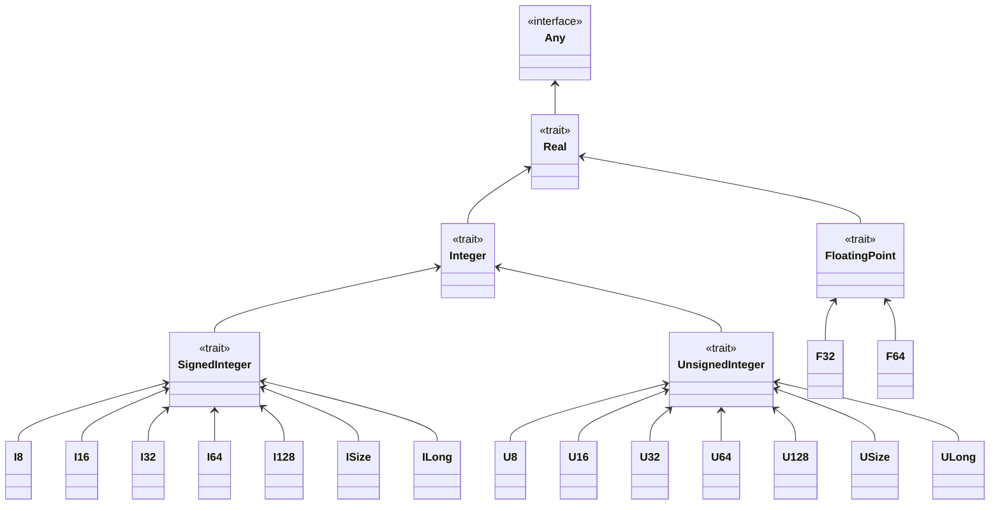

- Feature Name: Expand `math`
- Start Date: 2022-02-28
- RFC PR:
- Pony Issue:

# Summary

This RFC proposes expanding the standard library's `math` package and the shape it might take to leverage the full extent of Pony. There was prior discussion on [Zulip](https://ponylang.zulipchat.com/#narrow/stream/192795-contribute-to.20Pony/topic/math.20lib) years ago, but I expect some opinions to have changed.

# Motivation

Currently, `math` includes limited functionality. This should be expanded to include math types, constants, and present a structure with further expansion in mind. An expanded `math` library will allow a unified mathematics among Pony developers. As was discussed during our [2022-03-01 Sync](https://sync-recordings.ponylang.io/r/2022_03_01.m4a), one core principle for including these types in the stdlib is to have a single canonical implementation of them which allow interoperability of numeric types across the Pony ecosystem. Any numeric types introduced by this RFC **must** existing within the current numerical type hierarchy by being compliant with existing numeric traits.

# Detailed design

The primary goals of this initial expansion are:

1. restructure the `math` package into distinct subpackages; allowing for separation of concerns over continuing to build a monolithic `math` package
2. provide common `math` data types; for example, `BigInt`, `Rational`, and `Complex`

## Numeric Hierarchy

Current the Pony numerics hierarchy is as follows.



This RFC introduces a few more numeric types: `Rational`, `Complex`, and arbitrary precision `BigInt`. This fit into the hiearchy in the following manner.


## Structure

I propose a structure of distinct subpackages including the following:

+ `math/big`: Arbitrary precision numbers
+ `math/series`: Mathematical series
+ `math/constants`: Mathematical constants
+ `math/rational`: `Rational` data type and related functions
+ `math/complex`: `Complex` data type and related functions
+ `math/(x,exp,etc)`: experimental additions, utilities, and effective "catch-all" for matters that do not neatly fit into other subpackages

## Common Data Types

As previewed above in [Structure](#structure), expanding the `math` package should include implementations of common mathematics data types. Below are some implementation proposals for those data types.

### `math/big`

This is a package for arbitary precision numerics.

Should include `BigInt`, `BigFloat`, and `BigDecimal` -- see [168](https://github.com/ponylang/rfcs/issues/168)

### `math/series`

`math/series` should include a `Series` trait which is a subclass of `Iterator`. The purpose of creating a new abstract data type is to generalize functions over mathematical series which do not make sense over iterators -- such as whether a `Series` is diverging or converging, a property that is all but meaningless for an `Iterator`.

Example series include `Fibonacci` (already exists), `Pascal` (nCk), `Triangular` ({n+1}C{2}), `Square` (n^2), `Pentagonal` ({2n * (2n - 1)} / 2), etc.

Current `math/Fibonacci` would go into this series package.

### `math/constant`

Initial values to include are those with underlying LLVM representations from the [numbers namespace](https://llvm.org/doxygen/namespacellvm_1_1numbers.html).

Once these values exist in `math/constant`, they could be removed from where they are now, which is on `F32` and `F64` of [`Float`](https://github.com/ponylang/ponyc/blob/master/packages/builtin/float.pony).

I foresee this as a primitive `Constant` with methods for each value (e.g., `Constant.pi[A: Float](): A(3.14159...)`).

### `math/rational`

`math/rational` should decide backing precision on `create[A: UnsignedInteger]` and return precision on `apply[B: Number]` -- `let x = Rational.create[U64](where numerator=2)` gives a type which is represented by `U64(2)`/`U64(2)` which can then be returned as any valid `Number`. `Rational` should be parameterized only on `UnsignedInteger` types and track sign via an internal field.

```pony
// Parameterized on unsigned integers as negative status is tracked by field
class Rational[A: UnsignedInteger[A] val = USize]
  var numerator: A
  var denominator: A
  var negative: Bool = false
  
  // Allow for creating Rationals from signed or unsigned integer arguments
  new create[B: Integer[B] val = ISize](n: B, d: B = 1)? =>
    // Error if denominator is zero
    if d == B.from[U8](0) then error end
    
    // Produce unsigned equivalents of arguments
    // NOTE: this produces an error of form
    // Error:
    //   main.pony:XX:YY: type argument is outside its constraint
    // This is because Integer is not a subtype of UnsignedInteger
    let n': A = if n < B.from[U8](0) then A.from[B](-n) else A.from[B](n) end
    let n': A = if n < B.from[U8](0) then A.from[B](-n) else A.from[B](n) end
    let d': A = if d < B.from[U8](0) then A.from[B](-d) else A.from[B](d) end
    
    // Find greatest common divisor and reduce fraction
    let divisor: A = try GreatestCommonDivisor[A](n', d')? else A.from[U8](1) end
    numerator = n' / divisor
    denominator = d' / divisor
    
    // Set negative field if numerator, but not denominator is negative
    if (n < B.from[U8](0)) and (B.from[U8](0) < d) then
      negative = true
    end
    
  fun string(): String =>
    // Size of 10 here is a placeholder for determining the size needed
    let output = recover String(10) end
    if negative then output.append("-") end
    output.append(numerator.string())
    output.append(" / ")
    output.append(denominator.string())
    output
```

Changing the underlying precision "in-place" is done via a `prec[C: Real]` method which creates a new instance with a different precision.

(I see this package as subsuming `Decimal` and `Fractional` types, as previously discussed in Zulip.)

### `math/complex`

`Complex` should follow similar to `math/rational` in that it is parameterized on `Real` types which are used to represent both the real and imaginary part of the number -- `Complex[U128](7, 2)` is `U128(7) + U128(2)i`.

Changing the underlying precision is done via a `prec[C: Real]` method which creates a new instance of the value with a different precision.

### `math/(x,exp,etc)`

The name is subject to change and I want comments on what such a "catch all" package should be named to clearly denote it is for matters which do not neatly fit elsewhere.

The explicit intention of this subpackage is to gather useful matters that do not fit into another more dedicated packages. Examples of matters that would be included here are trigonometry and linear algebra functions before corresponding `math/trig` and `math/la` packaged are made.

Current `math/IsPrime` would go into this catch-all package.

# How We Teach This

For functionality additions, ample documentation and usage examples within the expanded `math` library should be sufficient.

I am proposing moving `Fibonacci` and `IsPrime` however nothing about existing functionality should change so teaching users about those updates should follow the pattern of providing example existing code with example modified code showing how to pick up the new locations of existing functionality.

A new chapter should be added as Tutorial > Packages > Math which walks through the layout and usage of Pony `math`.

# How We Test This

I recommend use of `pony_check` to test all reversible operations pairs (`x+y-y == x`, `x*y/y == x`, etc), precision persistence (`Rational[U8](where numerator=x, denominator=y) * y == x`), and overflow/underflow protection (`Rational[U8](255, 1) + 1 => error`).

Testing `math` should not affect any other parts of Pony and as such standard CI should suffice.

# Drawbacks

The major drawback is additional maintenance cost as well as immediate and continued disagreement around implementation and feature details.

# Alternatives

The amount of subpackages is a lot and could be reduced down to one single `math` package if we so choose as none of the proposed additions clash at this time.

# Unresolved questions

+ How expansive should the `math` library become (whether that is one package or multiple subpackages)?
+ Do we need all of `Decimal`, `Rational`, and `Fractional` types? I am unaware of their distinction so believe adding a `Rational` (numerator and denominator) type to suffice for current needs.
+ Do we want the types here to be additions to `math` or, since they are really more numeric types, additions alongside other numeric types within `builtin`?
